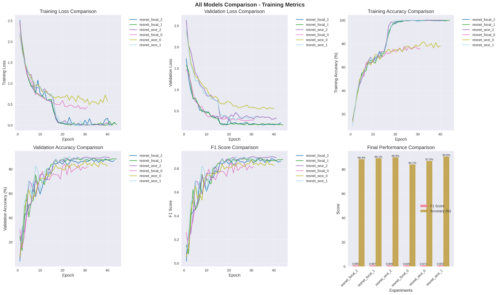

# Temple Image Classification Project

This project provides a complete pipeline for temple image classification using a custom, multi-class dataset. The repository includes advanced preprocessing techniques, sophisticated training strategies, and comprehensive solutions for handling class imbalance and improving model convergence.

## Requirements

It is recommended to use a virtual environment for this project. To set up your environment and install all necessary dependencies, run:

```bash
python -m venv toptal
source toptal/bin/activate  # On Windows use: toptal\Scripts\activate
pip install -r requirements.txt
```

## 1. Intro

This repository provides a robust solution for temple image classification, featuring advanced preprocessing, transfer learning, and class imbalance handling. The pipeline is designed for flexibility and high performance on challenging, imbalanced datasets.

## 2. Quick Start Guide

### Download Dataset
```bash
gdown --fuzzy "https://drive.google.com/file/d/1ccqGu9r815WvgHAlG2CujzUPOEW_Pvo9/view?usp=sharing"
```

### Preprocess Data
```bash
python preprocess.py --dataset ./dataset --output ./processed_dataset --image_size 512
```

### Train Mode
```bash
python train.py --model resnet50 --batch_size 32 --epochs 50 --loss weightedce --unfreeze 1
```

### Run Predictions

#### Predict a Single Image
```bash
python predict.py --model_path ./models/best_model.pth --image_path ./test_image.jpg
```
```bash
python predict.py --model_path ./models/best_model.pth --folder_path ./test_images/
```

## 3. Best Model Performance

### Best Model Details - Resnet50 WeightedCrossEntropy Freeze 1

(See: models/logs/classification_report.txt)

#### Per-Class Scores:
| Class Name                  | F1 Score | Precision | Recall | Support |
|-----------------------------|----------|-----------|--------|---------|
| Armenia                     | 1.00     | 1.00      | 1.00   | 2       |
| Australia                   | 0.88     | 0.78      | 1.00   | 7       |
| Germany                     | 0.87     | 0.94      | 0.81   | 21      |
| Hungary+Slovakia+Croatia    | 0.53     | 0.67      | 0.44   | 9       |
| Indonesia-Bali              | 1.00     | 1.00      | 1.00   | 9       |
| Japan                       | 1.00     | 1.00      | 1.00   | 12      |
| Malaysia+Indonesia          | 0.96     | 0.92      | 1.00   | 11      |
| Portugal+Brazil             | 0.83     | 0.71      | 1.00   | 10      |
| Russia                      | 0.94     | 0.96      | 0.92   | 24      |
| Spain                       | 0.85     | 0.85      | 0.85   | 13      |
| Thailand                    | 1.00     | 1.00      | 1.00   | 20      |


*Figure: Training and validation loss, accuracy, and F1 score history for the best model (Resnet50 WeightedCrossEntropy Freeze 1).*

## 4. All Model Performance

| Experiment        | Model   | Loss        | Unfreeze | Best F1         | Final Acc (%)      |
|------------------|---------|-------------|----------|-----------------|--------------------|
| resnet_wce_1     | resnet50| weightedce  | 1        | 0.902578623032131 | 90.58             |
| resnet_wce_2     | resnet50| weightedce  | 2        | 0.8993225387171052 | 89.86             |
| resnet_focal_1   | resnet50| focalloss   | 1        | 0.8868031651956108 | 89.13             |
| resnet_focal_2   | resnet50| focalloss   | 2        | 0.8850962640465959 | 88.41             |
| resnet_wce_0     | resnet50| weightedce  | 0        | 0.871163284456192 | 86.96             |
| resnet_focal_0   | resnet50| focalloss   | 0        | 0.8485570797925289 | 84.06             |



*Figure: Comprehensive comparison of training loss, validation loss, accuracy, F1 score, and final performance for all model experiments (resnet_focal_2, resnet_focal_1, resnet_wce_2, resnet_focal_0, resnet_wce_0, resnet_wce_1).*

> **Note:**
> - **Best F1**: Highest weighted F1 score achieved during training.
> - **Final Acc (%)**: Final validation accuracy (percentage).
> - **Unfreeze**: 0 = feature extraction, 1 = two-stage unfreezing, 2 = three-stage unfreezing.
> - **All experiments used image size 512x512.**

## 5. Key Technical Innovations/Technical Details

### 1. Adaptive Preprocessing
- **Dynamic Image Sizing:** All images are resized to a configurable resolution (default 512x512) for consistent feature extraction.
- **Class-Aware Augmentation:** The augmentation rate is dynamically adjusted based on class size:
  - Large classes (≥80 images): Minimal augmentation (20%)
  - Medium-large (≥50): Light augmentation (40%)
  - Medium (≥25): Moderate augmentation (60%)
  - Small (<25): Heavy augmentation (80%)
- **Augmentation Pipeline:** Uses albumentations for a rich set of transformations:
  - Geometric: Horizontal flip, random rotation, shift-scale-rotate
  - Lighting: Random brightness/contrast, gamma correction
  - Color: Hue/saturation/value shifts
  - Noise/Blur: Gaussian noise, blur, CLAHE for detail enhancement
- **Robust Data Splitting:** Ensures every class is represented in train/validation splits, even for rare classes.
- **Error Handling:** Corrupted images are detected and replaced with blank images to prevent training crashes.

### 2. Class Imbalance Handling
- **Weighted Random Sampling:** Each batch is balanced using a sampler that gives higher probability to minority classes.
- **Class Weights in Loss:** Loss functions (cross-entropy, focal loss) are weighted inversely to class frequency, so rare classes have more influence.
- **Focal Loss:** Custom implementation that focuses learning on hard-to-classify examples, with a tunable gamma parameter.
- **Multi-Metric Evaluation:** Tracks F1 (macro, weighted) and accuracy to ensure fair assessment across all classes.

### 3. Training Optimizations
- **Optimizer:** Uses AdamW for better weight decay and generalization.
- **Learning Rate Scheduling:** ReduceLROnPlateau scheduler automatically reduces learning rate when validation F1 plateaus.
- **Early Stopping:** Training halts if validation F1 does not improve for a set number of epochs, preventing overfitting.
- **Gradient Clipping:** All gradients are clipped (max_norm=1.0) to prevent exploding gradients and stabilize training.
- **Model Checkpointing:** Best model (by validation F1) is always saved for reproducibility.
- **Comprehensive Logging:** All metrics, losses, and configurations are logged for each experiment.

### 4. Advanced Transfer Learning with Staged Unfreezing
- **Staged Unfreezing:** Three strategies:
  - Mode 0: Only classifier layers are trainable (feature extraction)
  - Mode 1: Classifier layers first, then deepest backbone block (layer4) after 15 epochs
  - Mode 2: Classifier layers, then layer4, then all layers after 30 epochs
- **Adaptive Learning Rate:** Learning rate is reduced by 10x at each unfreezing stage to allow stable adaptation.
- **Pretrained Backbone:** Uses ImageNet-pretrained ResNet50 for strong initial features.
- **Custom Classifier:** Fully connected layers are configurable for the classification head, with dropout and batch normalization for regularization.
